# Dossiê Grupo 7

## Integrantes

- Antônio Enzo Ferreira do Nascimento
- Edson da Silva Lima Junior
- Jórdan Carvalho Araújo
- Micaías Carvalho Vieira

---

## Diagrama Entidade Relacionamento

```mermaid
erDiagram
    DEPUTADO ||--o{ GASTO : "realiza (1:n)"
    DEPUTADO }o--o{ EVENTO : "presença (n:n)"
    DEPUTADO }o--o{ VOTACAO : "voto (n:n)"
    DEPUTADO }o--o{ PROPOSICAO : "autoria (n:n)"
    EVENTO ||--o{ VOTACAO : "tem (1:n)"
    VOTACAO }o--o{ PROPOSICAO : "pauta (n:n)"
    VOTACAO }o--o{ BANCADA : "orienta (n:n)"
    PROPOSICAO }o--o{ TEMA : "classifica (n:n)"

    DEPUTADO {
        INTEGER id PK "Identificador numérico único do deputado"
        VARCHAR uri "Endereço completo do recurso na API"
        VARCHAR nome "Nome parlamentar adotado na legislatura"
        INTEGER idLegislaturaInicial "Primeira legislatura do deputado"
        INTEGER idLegislaturaFinal "Última legislatura (ou atual)"
        VARCHAR nomeCivil "Nome civil completo"
        VARCHAR cpf "CPF sem pontuação"
        CHAR siglaSexo "Sexo do parlamentar"
        VARCHAR urlRedeSocial "URLs de redes sociais"
        VARCHAR urlWebsite "Site pessoal do deputado"
        DATE dataNascimento "Data de nascimento"
        DATE dataFalecimento "Data de falecimento, se aplicável"
        CHAR ufNascimento "UF onde o deputado nasceu"
        VARCHAR municipioNascimento "Cidade de nascimento"
        VARCHAR escolaridade "Grau de escolaridade autodeclarado"
        VARCHAR urlFoto "Endereço para a foto do deputado"
    }

    GASTO {
        INTEGER ideDocumento PK "Identificador interno do documento comprobatório"
        INTEGER idDeCadastro FK "Identificador de cadastro do deputado (FK → deputado.id)"
        VARCHAR txNomeParlamentar "Nome do parlamentar ou órgão beneficiário"
        VARCHAR cpf "CPF do parlamentar beneficiário"
        INTEGER nuDeputadoId "Identificador do deputado que realizou a despesa"
        INTEGER nuCarteiraParlamentar "Número da carteira parlamentar"
        INTEGER nuLegislatura "Número da legislatura do gasto"
        CHAR sgUF "UF do deputado no momento da despesa"
        VARCHAR sgPartido "Partido do deputado no momento da despesa"
        INTEGER codLegislatura "Código numérico da legislatura"
        INTEGER numSubCota "Código da categoria de despesa"
        VARCHAR txtDescricao "Descrição da categoria de despesa CEAP"
        INTEGER numEspecificacaoSubCota "Código de especificação adicional"
        VARCHAR txtDescricaoEspecificacao "Descrição da especificação da subcota"
        VARCHAR txtFornecedor "Nome do fornecedor conforme nota fiscal"
        VARCHAR txtCNPJCPF "CNPJ ou CPF do fornecedor"
        VARCHAR txtNumero "Número do documento fiscal"
        INTEGER indTipoDocumento "Tipo de documento"
        DATETIME datEmissao "Data de emissão do documento fiscal"
        DECIMAL vlrDocumento "Valor de face do documento"
        DECIMAL vlrGlosa "Valor retido não coberto pela CEAP"
        DECIMAL vlrLiquido "Valor efetivamente debitado da cota"
        INTEGER numMes "Mês de competência financeira"
        INTEGER numAno "Ano de competência financeira"
        INTEGER numParcela "Número da parcela"
        VARCHAR txtPassageiro "Nome do passageiro em viagem"
        VARCHAR txtTrecho "Trecho da viagem (padrão IATA)"
        INTEGER numLote "Número do lote de processamento"
        INTEGER numRessarcimento "Número do ressarcimento no lote"
        DATETIME datPagamentoRestituicao "Data de pagamento de restituição"
        DECIMAL vlrRestituicao "Valor devolvido à Câmara"
        VARCHAR urlDocumento "Link para o PDF da despesa"
    }

    EVENTO {
        INTEGER id PK "Identificador único do evento"
        VARCHAR uri "URI do evento na API"
        VARCHAR urlDocumentoPauta "URL da pauta em PDF"
        DATETIME dataHoraInicio "Data e hora de início"
        DATETIME dataHoraFim "Data e hora de encerramento"
        VARCHAR situacao "Status do evento"
        TEXT descricao "Descrição ou pauta do evento"
        VARCHAR descricaoTipo "Tipo do evento"
        VARCHAR localExterno "Local externo ao complexo da Câmara"
        VARCHAR localCamara_nome "Nome do local dentro da Câmara"
        VARCHAR localCamara_predio "Prédio do local"
        VARCHAR localCamara_sala "Sala ou plenário"
        VARCHAR localCamara_andar "Andar do local"
    }

    VOTACAO {
        VARCHAR id PK "Identificador único da votação"
        VARCHAR uri "URI da votação na API"
        DATE data "Data da votação"
        DATETIME dataHoraRegistro "Data e hora exata do registro"
        INTEGER idOrgao "Código do órgão responsável"
        VARCHAR uriOrgao "URI do órgão"
        VARCHAR siglaOrgao "Sigla do órgão"
        INTEGER idEvento FK "Evento/sessão que sediou a votação"
        VARCHAR uriEvento "URI do evento associado"
        INTEGER aprovacao "Resultado da votação"
        INTEGER votosSim "Total de votos 'Sim'"
        INTEGER votosNao "Total de votos 'Não'"
        INTEGER votosOutros "Total de abstenções e outros"
        TEXT descricao "Descrição do objeto votado"
        DATETIME ultimaAberturaVotacao_dataHoraRegistro "Momento da última abertura"
        VARCHAR ultimaAberturaVotacao_descricao "Descrição da última abertura"
        DATETIME ultimaApresentacaoProposicao_dataHoraRegistro "Momento da apresentação"
        TEXT ultimaApresentacaoProposicao_descricao "Descrição da apresentação"
        INTEGER ultimaApresentacaoProposicao_idProposicao "ID da proposição votada"
        VARCHAR ultimaApresentacaoProposicao_uriProposicao "URI da proposição"
    }

    PROPOSICAO {
        INTEGER id PK "Identificador único da proposição"
        VARCHAR uri "URI da proposição na API"
        VARCHAR siglaTipo "Tipo da proposição"
        INTEGER numero "Número sequencial no ano"
        INTEGER ano "Ano de apresentação"
        INTEGER codTipo "Código numérico do tipo"
        VARCHAR descricaoTipo "Descrição textual do tipo"
        TEXT ementa "Ementa resumida da proposição"
        TEXT ementaDetalhada "Ementa detalhada (pode conter HTML)"
        VARCHAR keywords "Palavras-chave separadas por vírgula"
        DATETIME dataApresentacao "Data e hora de apresentação formal"
        VARCHAR uriOrgaoNumerador "URI do órgão numerador"
        VARCHAR uriPropAnterior "URI da proposição anterior"
        VARCHAR uriPropPrincipal "URI da proposição principal"
        VARCHAR uriPropPosterior "URI da proposição posterior"
        VARCHAR urlInteiroTeor "Link para o texto completo"
        VARCHAR urnFinal "URN final da proposição"
        DATETIME ultimoStatus_dataHora "Data/hora do último status"
        INTEGER ultimoStatus_sequencia "Sequência do status"
        VARCHAR ultimoStatus_uriRelator "URI do relator"
        INTEGER ultimoStatus_idOrgao "Código do órgão atual"
        VARCHAR ultimoStatus_siglaOrgao "Sigla do órgão"
        VARCHAR ultimoStatus_uriOrgao "URI do órgão"
        VARCHAR ultimoStatus_regime "Regime de tramitação"
        TEXT ultimoStatus_descricaoTramitacao "Descrição da tramitação"
        INTEGER ultimoStatus_idTipoTramitacao "Código do tipo de tramitação"
        VARCHAR ultimoStatus_descricaoSituacao "Situação atual"
        INTEGER ultimoStatus_idSituacao "Código da situação"
    }

    TEMA {
        INTEGER codTema PK "Código numérico do tema"
        VARCHAR tema "Nome descritivo da área temática"
        INTEGER relevancia "Nível de relevância do tema"
    }

    BANCADA {
        VARCHAR siglaBancada PK "Sigla da bancada ou partido"
        VARCHAR uriBancada "URI da bancada na API"
    }

    PRESENCA {
        INTEGER idEvento FK "Identificador do evento"
        INTEGER idDeputado FK "Identificador do deputado presente"
        DATETIME data "Data/hora do início do evento"
        VARCHAR uriEvento "URI do evento"
        VARCHAR uriDeputado "URI do deputado"
    }

    VOTO {
        VARCHAR idVotacao FK "Votação em que o voto foi registrado"
        INTEGER deputado_id FK "Deputado que emitiu o voto"
        VARCHAR voto "Voto registrado"
        DATETIME dataHoraVoto "Data e hora exata do registro"
        VARCHAR deputado_uri "URI do deputado"
        VARCHAR deputado_nome "Nome do deputado no momento do voto"
        VARCHAR deputado_siglaPartido "Partido no momento do voto"
        CHAR deputado_siglaUf "UF do deputado"
        VARCHAR deputado_urlFoto "URL da foto"
    }

    PAUTA {
        VARCHAR idVotacao FK "Votação que deliberou sobre a proposição"
        INTEGER proposicao_id FK "Proposição que entrou em pauta"
        DATE data "Data da votação"
        VARCHAR descricao "Descrição do objeto votado"
        VARCHAR proposicao_uri "URI da proposição"
        VARCHAR proposicao_titulo "Título da proposição"
        TEXT proposicao_ementa "Ementa da proposição"
        INTEGER proposicao_codTipo "Código do tipo"
        VARCHAR proposicao_siglaTipo "Sigla do tipo"
        INTEGER proposicao_numero "Número da proposição"
        INTEGER proposicao_ano "Ano da proposição"
    }

    ORIENTACAO {
        VARCHAR idVotacao FK "Votação à qual a orientação se refere"
        VARCHAR siglaBancada FK "Bancada que emitiu a orientação"
        VARCHAR uriVotacao "URI da votação"
        VARCHAR siglaOrgao "Órgão onde ocorreu"
        TEXT descricao "Descrição da orientação emitida"
        VARCHAR uriBancada "URI da bancada"
        VARCHAR orientacao "Voto orientado pela liderança"
    }

    AUTORIA {
        INTEGER idProposicao FK "Proposição à qual a autoria pertence"
        INTEGER idDeputadoAutor FK "Deputado que assinou a proposição"
        VARCHAR uriProposicao "URI da proposição"
        VARCHAR uriAutor "URI do autor"
        INTEGER codTipoAutor "Código do tipo de autor"
        VARCHAR tipoAutor "Descrição do tipo de autor"
        VARCHAR nomeAutor "Nome do autor conforme registrado"
        VARCHAR siglaPartidoAutor "Partido do autor na assinatura"
        VARCHAR uriPartidoAutor "URI do partido do autor"
        CHAR siglaUFAutor "UF do autor"
        INTEGER ordemAssinatura "Ordem de assinatura"
        INTEGER proponente "Indicador de proponente"
    }

    CLASSIFICACAO {
        INTEGER idProposicao FK "Proposição classificada no tema"
        INTEGER codTema FK "Código do tema associado"
        VARCHAR uriProposicao "URI da proposição"
        VARCHAR siglaTipo "Tipo da proposição"
        INTEGER numero "Número da proposição"
        INTEGER ano "Ano da proposição"
        INTEGER relevancia "Relevância do tema para esta proposição"
    }
```



> **Nota sobre o diagrama:** os relacionamentos `presença`, `voto`, `autoria`, `pauta`, `orienta` e `classifica` são do tipo muitos-para-muitos (n:n) e, na implementação física, são materializados pelas tabelas associativas `PRESENCA`, `VOTO`, `AUTORIA`, `PAUTA`, `ORIENTACAO` e `CLASSIFICACAO`, respectivamente. O relacionamento `realiza` (Deputado → Gastos) é 1:n, assim como `tem` (Evento → Votacoes).

---

## Dicionário de Dados

### Fonte dos Dados e Arquivos CSV utilizados

API de Dados Abertos da Câmara dos Deputados: <https://dadosabertos.camara.leg.br/swagger/api.html?tab=api>

| Arquivo CSV | Endpoint(s) da API |
|---|---|
| `deputados.csv` | `GET /deputados` · `GET /deputados/{id}` |
| `Ano-AAAA.csv` | `http://www.camara.leg.br/cotas/Ano-{ano}.csv` |
| `eventos-AAAA.csv` | `GET /eventos` · `GET /eventos/{id}` |
| `votacoes-AAAA.csv` | `GET /votacoes` · `GET /votacoes/{id}` |
| `proposicoes-AAAA.csv` | `GET /proposicoes` · `GET /proposicoes/{id}` |
| `proposicoesTemas-AAAA.csv` | `GET /referencias/proposicoes/codTema` |
| `votacoesOrientacoes-AAAA.csv` | `GET /votacoes/{id}/orientacoes` |
| `eventosPresencaDeputados-AAAA.csv` | — |
| `votacoesVotos-AAAA.csv` | `GET /votacoes/{id}/votos` |
| `votacoesProposicoes-AAAA.csv` | `GET /votacoes/{id}/proposicoes` |
| `proposicoesAutores-AAAA.csv` | `GET /proposicoes/{id}/autores` |

---

### DEPUTADO

| Campo | Tipo | Tamanho | Chave | Null? | Descrição |
|---|---|---|---|---|---|
| uri | VARCHAR | 200 |  | NÃO | Endereço completo do recurso na API. |
| nome | VARCHAR | 100 |  | NÃO | Nome parlamentar adotado na legislatura. |
| idLegislaturaInicial | INTEGER | — |  | SIM | Primeira legislatura do deputado. |
| idLegislaturaFinal | INTEGER | — |  | SIM | Última legislatura (ou atual). |
| nomeCivil | VARCHAR | 100 |  | SIM | Nome civil completo conforme documentos oficiais. |
| cpf | VARCHAR | 11 |  | SIM | CPF do deputado sem pontuação. |
| siglaSexo | CHAR | 1 |  | SIM | Sexo do parlamentar. |
| urlRedeSocial | VARCHAR | 500 |  | SIM | URLs de redes sociais (pode conter múltiplas). |
| urlWebsite | VARCHAR | 500 |  | SIM | Site pessoal do deputado. |
| dataNascimento | DATE | — |  | SIM | Data de nascimento. |
| dataFalecimento | DATE | — |  | SIM | Data de falecimento, se aplicável. |
| ufNascimento | CHAR | 2 |  | SIM | UF onde o deputado nasceu. |
| municipioNascimento | VARCHAR | 100 |  | SIM | Cidade de nascimento. |
| escolaridade | VARCHAR | 80 |  | SIM | Grau de escolaridade autodeclarado. |
| id | INTEGER | — | PK | NÃO | Identificador numérico único do deputado (calculado). |
| urlFoto | VARCHAR | 200 |  | SIM | Endereço da foto do deputado. |

---

### GASTO

| Campo | Tipo | Tamanho | Chave | Null? | Descrição |
|---|---|---|---|---|---|
| ideDocumento | INTEGER | — | PK | NÃO | Identificador interno do documento comprobatório. |
| idDeCadastro | INTEGER | — | FK → deputado.id | SIM | Identificador interno de cadastro. |
| nuDeputadoId | INTEGER | — |  | SIM | Identificador do deputado que realizou a despesa. |
| txNomeParlamentar | VARCHAR | 100 |  | NÃO | Nome do parlamentar ou órgão beneficiário. |
| cpf | VARCHAR | 11 |  | SIM | CPF do parlamentar beneficiário. |
| nuCarteiraParlamentar | INTEGER | — |  | SIM | Número da carteira parlamentar. |
| nuLegislatura | INTEGER | — |  | NÃO | Número da legislatura do gasto. |
| sgUF | CHAR | 2 |  | SIM | UF do deputado no momento da despesa. |
| sgPartido | VARCHAR | 20 |  | SIM | Partido do deputado no momento da despesa. |
| codLegislatura | INTEGER | — |  | NÃO | Código numérico da legislatura. |
| numSubCota | INTEGER | — |  | NÃO | Código da categoria de despesa. |
| txtDescricao | VARCHAR | 200 |  | NÃO | Descrição da categoria de despesa CEAP. |
| numEspecificacaoSubCota | INTEGER | — |  | SIM | Código de especificação adicional da subcota. |
| txtDescricaoEspecificacao | VARCHAR | 200 |  | SIM | Descrição da especificação da subcota. |
| txtFornecedor | VARCHAR | 200 |  | NÃO | Nome do fornecedor conforme nota fiscal. |
| txtCNPJCPF | VARCHAR | 18 |  | SIM | CNPJ ou CPF do fornecedor com pontuação. |
| txtNumero | VARCHAR | 50 |  | NÃO | Número do documento fiscal. |
| indTipoDocumento | INTEGER | — |  | SIM | Tipo de documento. |
| datEmissao | DATETIME | — |  | NÃO | Data de emissão do documento fiscal. |
| vlrDocumento | DECIMAL | 10,2 |  | NÃO | Valor de face do documento. |
| vlrGlosa | DECIMAL | 10,2 |  | NÃO | Valor retido não coberto pela CEAP. |
| vlrLiquido | DECIMAL | 10,2 |  | NÃO | Valor efetivamente debitado da cota parlamentar. |
| numMes | INTEGER | — |  | NÃO | Mês de competência financeira. |
| numAno | INTEGER | — |  | NÃO | Ano de competência financeira. |
| numParcela | INTEGER | — |  | NÃO | Número da parcela. |
| txtPassageiro | VARCHAR | 100 |  | SIM | Nome do passageiro em registros de viagem. |
| txtTrecho | VARCHAR | 200 |  | SIM | Trecho da viagem (padrão IATA). |
| numLote | INTEGER | — |  | SIM | Número do lote de processamento. |
| numRessarcimento | INTEGER | — |  | SIM | Número do ressarcimento no lote. |
| datPagamentoRestituicao | DATETIME | — |  | SIM | Data de pagamento de restituição à Câmara. |
| vlrRestituicao | DECIMAL | 10,2 |  | SIM | Valor devolvido à Câmara. |
| urlDocumento | VARCHAR | 500 |  | SIM | Link para o PDF da despesa. |

---

### EVENTO

| Campo | Tipo | Tamanho | Chave | Null? | Descrição |
|---|---|---|---|---|---|
| id | INTEGER | — | PK | NÃO | Identificador único do evento. |
| uri | VARCHAR | 200 |  | NÃO | URI do evento na API. |
| urlDocumentoPauta | VARCHAR | 500 |  | SIM | URL da pauta em PDF. |
| dataHoraInicio | DATETIME | — |  | SIM | Data e hora de início. |
| dataHoraFim | DATETIME | — |  | SIM | Data e hora de encerramento. |
| situacao | VARCHAR | 50 |  | NÃO | Status do evento. |
| descricao | TEXT | — |  | SIM | Descrição ou pauta do evento. |
| descricaoTipo | VARCHAR | 100 |  | NÃO | Tipo do evento. |
| localExterno | VARCHAR | 200 |  | SIM | Local externo ao complexo da Câmara. |
| localCamara.nome | VARCHAR | 200 |  | SIM | Nome do local dentro da Câmara. |
| localCamara.predio | VARCHAR | 50 |  | SIM | Prédio do local. |
| localCamara.sala | VARCHAR | 20 |  | SIM | Sala ou plenário. |
| localCamara.andar | VARCHAR | 20 |  | SIM | Andar do local. |

---

### VOTACAO

| Campo | Tipo | Tamanho | Chave | Null? | Descrição |
|---|---|---|---|---|---|
| id | VARCHAR | 20 | PK | NÃO | Identificador único da votação. |
| uri | VARCHAR | 200 |  | NÃO | URI da votação na API. |
| data | DATE | — |  | NÃO | Data da votação. |
| dataHoraRegistro | DATETIME | — |  | NÃO | Data e hora exata do registro. |
| idOrgao | INTEGER | — |  | NÃO | Código do órgão responsável. |
| uriOrgao | VARCHAR | 200 |  | NÃO | URI do órgão. |
| siglaOrgao | VARCHAR | 10 |  | NÃO | Sigla do órgão. |
| idEvento | INTEGER | — | FK → evento.id | NÃO | Evento/sessão que sediou a votação. |
| uriEvento | VARCHAR | 200 |  | NÃO | URI do evento associado. |
| aprovacao | INTEGER | — |  | SIM | Resultado da votação. |
| votosSim | INTEGER | — |  | SIM | Total de votos 'Sim'. |
| votosNao | INTEGER | — |  | SIM | Total de votos 'Não'. |
| votosOutros | INTEGER | — |  | SIM | Total de abstenções e outros. |
| descricao | TEXT | — |  | SIM | Descrição do objeto votado. |
| ultimaAberturaVotacao_dataHoraRegistro | DATETIME | — |  | SIM | Momento da última abertura. |
| ultimaAberturaVotacao_descricao | VARCHAR | 200 |  | SIM | Descrição da última abertura. |
| ultimaApresentacaoProposicao_dataHoraRegistro | DATETIME | — |  | SIM | Momento da apresentação da proposição. |
| ultimaApresentacaoProposicao_descricao | TEXT | — |  | SIM | Descrição da apresentação. |
| ultimaApresentacaoProposicao_idProposicao | INTEGER | — |  | SIM | ID da proposição votada. |
| ultimaApresentacaoProposicao_uriProposicao | VARCHAR | 200 |  | SIM | URI da proposição. |

---

### PROPOSICAO

| Campo | Tipo | Tamanho | Chave | Null? | Descrição |
|---|---|---|---|---|---|
| id | INTEGER | — | PK | NÃO | Identificador único da proposição. |
| uri | VARCHAR | 200 |  | NÃO | URI da proposição na API. |
| siglaTipo | VARCHAR | 10 |  | NÃO | Tipo da proposição. |
| numero | INTEGER | — |  | NÃO | Número sequencial no ano. |
| ano | INTEGER | — |  | NÃO | Ano de apresentação. |
| codTipo | INTEGER | — |  | NÃO | Código numérico do tipo. |
| descricaoTipo | VARCHAR | 100 |  | NÃO | Descrição textual do tipo. |
| ementa | TEXT | — |  | SIM | Ementa resumida da proposição. |
| ementaDetalhada | TEXT | — |  | SIM | Ementa detalhada. Pode conter HTML. |
| keywords | VARCHAR | 500 |  | SIM | Palavras-chave separadas por vírgula. |
| dataApresentacao | DATETIME | — |  | SIM | Data e hora de apresentação formal. |
| uriOrgaoNumerador | VARCHAR | 200 |  | SIM | URI do órgão numerador. |
| uriPropAnterior | VARCHAR | 200 |  | SIM | URI da proposição anterior. |
| uriPropPrincipal | VARCHAR | 200 |  | SIM | URI da proposição principal. |
| uriPropPosterior | VARCHAR | 200 |  | SIM | URI da proposição posterior. |
| urlInteiroTeor | VARCHAR | 500 |  | SIM | Link para o texto completo. |
| urnFinal | VARCHAR | 100 |  | SIM | URN final da proposição. |
| ultimoStatus_dataHora | DATETIME | — |  | SIM | Data/hora do último status. |
| ultimoStatus_sequencia | INTEGER | — |  | SIM | Sequência do status. |
| ultimoStatus_uriRelator | VARCHAR | 200 |  | SIM | URI do relator. |
| ultimoStatus_idOrgao | INTEGER | — |  | SIM | Código do órgão atual. |
| ultimoStatus_siglaOrgao | VARCHAR | 20 |  | SIM | Sigla do órgão. |
| ultimoStatus_uriOrgao | VARCHAR | 200 |  | SIM | URI do órgão. |
| ultimoStatus_regime | VARCHAR | 100 |  | SIM | Regime de tramitação. |
| ultimoStatus_descricaoTramitacao | TEXT | — |  | SIM | Descrição da tramitação. |
| ultimoStatus_idTipoTramitacao | INTEGER | — |  | SIM | Código do tipo de tramitação. |
| ultimoStatus_descricaoSituacao | VARCHAR | 100 |  | SIM | Situação atual. |
| ultimoStatus_idSituacao | INTEGER | — |  | SIM | Código da situação. |

---

### TEMA

| Campo | Tipo | Tamanho | Chave | Null? | Descrição |
|---|---|---|---|---|---|
| codTema | INTEGER | — | PK | NÃO | Código numérico do tema. |
| tema | VARCHAR | 100 |  | NÃO | Nome descritivo da área temática. |
| relevancia | INTEGER | — |  | SIM | Nível de relevância do tema. |

---

### BANCADA

| Campo | Tipo | Tamanho | Chave | Null? | Descrição |
|---|---|---|---|---|---|
| siglaBancada | VARCHAR | 20 | PK | NÃO | Sigla da bancada ou partido. |
| uriBancada | VARCHAR | 200 |  | SIM | URI da bancada na API. |

---

### PRESENCA

| Campo | Tipo | Tamanho | Chave | Null? | Descrição |
|---|---|---|---|---|---|
| idEvento | INTEGER | — | FK → evento.id | NÃO | Identificador do evento. |
| idDeputado | INTEGER | — | FK → deputado.id | NÃO | Identificador do deputado presente. |
| data | DATETIME | — |  | SIM | Data/hora do início do evento. |
| uriEvento | VARCHAR | 200 |  | SIM | URI do evento. |
| uriDeputado | VARCHAR | 200 |  | SIM | URI do deputado. |

---

### VOTO

| Campo | Tipo | Tamanho | Chave | Null? | Descrição |
|---|---|---|---|---|---|
| idVotacao | VARCHAR | 20 | FK → votacao.id | NÃO | Votação em que o voto foi registrado. |
| deputado_id | INTEGER | — | FK → deputado.id | NÃO | Deputado que emitiu o voto. |
| voto | VARCHAR | 10 |  | SIM | Voto registrado. |
| dataHoraVoto | DATETIME | — |  | SIM | Data e hora exata do registro. |
| deputado_uri | VARCHAR | — |  | SIM | URI do deputado. |
| deputado_nome | VARCHAR | — |  | SIM | Nome do deputado no momento do voto. |
| deputado_siglaPartido | VARCHAR | — |  | SIM | Partido no momento do voto. |
| deputado_siglaUf | CHAR | 2 |  | SIM | UF do deputado. |
| deputado_urlFoto | VARCHAR | — |  | SIM | URL da foto. |

---

### PAUTA

| Campo | Tipo | Tamanho | Chave | Null? | Descrição |
|---|---|---|---|---|---|
| idVotacao | VARCHAR | 20 | FK → votacao.id | NÃO | Votação que deliberou sobre a proposição. |
| proposicao_id | INTEGER | — | FK → proposicao.id | NÃO | Proposição que entrou em pauta. |
| data | DATE | — |  | SIM | Data da votação. |
| descricao | VARCHAR | 200 |  | SIM | Descrição do objeto votado. |
| proposicao_uri | VARCHAR | 200 |  | SIM | URI da proposição. |
| proposicao_titulo | VARCHAR | 100 |  | SIM | Título da proposição. |
| proposicao_ementa | TEXT | — |  | SIM | Ementa da proposição. |
| proposicao_codTipo | INTEGER | — |  | SIM | Código do tipo. |
| proposicao_siglaTipo | VARCHAR | 20 |  | SIM | Sigla do tipo. |
| proposicao_numero | INTEGER | — |  | SIM | Número da proposição. |
| proposicao_ano | INTEGER | — |  | SIM | Ano da proposição. |

---

### ORIENTACAO

| Campo | Tipo | Tamanho | Chave | Null? | Descrição |
|---|---|---|---|---|---|
| idVotacao | VARCHAR | 20 | FK → votacao.id | NÃO | Votação à qual a orientação se refere. |
| siglaBancada | VARCHAR | 20 | FK → bancada.siglaBancada | NÃO | Bancada que emitiu a orientação. |
| uriVotacao | VARCHAR | 200 |  | SIM | URI da votação. |
| siglaOrgao | VARCHAR | 20 |  | SIM | Órgão onde ocorreu. |
| descricao | TEXT | 200 |  | SIM | Descrição da orientação emitida. |
| uriBancada | VARCHAR | 200 |  | SIM | URI da bancada. |
| orientacao | VARCHAR | 10 |  | SIM | Voto orientado pela liderança. |

---

### AUTORIA

| Campo | Tipo | Tamanho | Chave | Null? | Descrição |
|---|---|---|---|---|---|
| idProposicao | INTEGER | — | FK → proposicao.id | NÃO | Proposição à qual a autoria pertence. |
| idDeputadoAutor | INTEGER | — | FK → deputado.id | SIM | Deputado que assinou a proposição. |
| uriProposicao | VARCHAR | 200 |  | SIM | URI da proposição. |
| uriAutor | VARCHAR | 200 |  | SIM | URI do autor. |
| codTipoAutor | INTEGER | — |  | SIM | Código do tipo de autor. |
| tipoAutor | VARCHAR | 100 |  | SIM | Descrição do tipo de autor. |
| nomeAutor | VARCHAR | 100 |  | SIM | Nome do autor conforme registrado. |
| siglaPartidoAutor | VARCHAR | 20 |  | SIM | Partido do autor na assinatura. |
| uriPartidoAutor | VARCHAR | 200 |  | SIM | URI do partido do autor. |
| siglaUFAutor | CHAR | 2 |  | SIM | UF do autor. |
| ordemAssinatura | INTEGER | — |  | SIM | Ordem de assinatura. |
| proponente | INTEGER | — |  | SIM | Indicador de proponente. |

---

### CLASSIFICACAO

| Campo | Tipo | Tamanho | Chave | Null? | Descrição |
|---|---|---|---|---|---|
| idProposicao | INTEGER | — | FK → proposicao.id | NÃO | Proposição classificada no tema. |
| codTema | INTEGER | — | FK → tema.codTema | NÃO | Código do tema associado. |
| uriProposicao | VARCHAR | — |  | SIM | URI da proposição. |
| siglaTipo | VARCHAR | 20 |  | SIM | Tipo da proposição. |
| numero | INTEGER | — |  | SIM | Número da proposição. |
| ano | INTEGER | — |  | SIM | Ano da proposição. |
| relevancia | INTEGER | — |  | SIM | Relevância do tema para esta proposição. |

---

## Perguntas

1. Deputados ordenados por gastos.
2. Agrupar deputados por eixo de atuação (Nuvem de Palavras) — Ex.: eixo social, econômico, tributário, segurança, saúde, etc.
3. Como um deputado votou em um tema/eixo específico.
4. Agrupar deputados por escolaridade.
5. Ordenar fornecedores (despesas) por valores de contrato.
6. Correlacionar escolaridade com:
   a. Gastos;
   b. Fidelidade Partidária;
   c. Nº de proposições;
   d. Presença em eventos;
   e. Presença no plenário.
8. Ordenar por influência. Calcular o % de propostas aprovadas pelo deputado. O % é em relação ao total de propostas apresentadas no plenário.

---

## Scripts de Análise

### Q1 — `q1_gastos_deputados.py` — Deputados por gastos totais

**Execução:** `python q1_gastos_deputados.py`

**Método de cálculo:**
- Junta `deputado` com `gasto` via `idDeCadastro`.
- Agrupa por deputado (id, nome, partido, UF).
- Calcula `SUM(vlrLiquido)` como total gasto e `COUNT(ideDocumento)` como número de transações.
- Ordena pelo total gasto decrescente (top 50).

---

### Q2 — `q2_eixo_atuacao.py` — Eixo de atuação por deputado

**Execução:** `python q2_eixo_atuacao.py`

**Método de cálculo:**
- **Ranking geral de temas:** junta `tema → classificacao → autoria`, conta proposições distintas e deputados distintos por tema.
- **Tema dominante por deputado:** via CTE com `ROW_NUMBER() OVER (PARTITION BY d.id ORDER BY COUNT(*) DESC)` — seleciona o tema com maior número de proposições de autoria de cada deputado.
- Exibe os top 50 deputados por volume de proposições no tema dominante.

---

### Q3 — `q3_votacao_tema.py` — Votos de um deputado em um tema

**Execução:** `python q3_votacao_tema.py <id_deputado> "<tema>"`

Exemplo: `python q3_votacao_tema.py 204554 "Economia"`

**Método de cálculo:**
- Junta `voto → pauta → classificacao → tema` para recuperar todos os votos do deputado em proposições classificadas no tema informado.
- Calcula o percentual de cada tipo de voto com a window function:
  `100.0 * COUNT(*) / SUM(COUNT(*)) OVER (PARTITION BY d.id, t.codTema)`
- Sem argumentos, lista todos os temas disponíveis.

---

### Q4 — `q4_escolaridade.py` — Distribuição por escolaridade

**Execução:** `python q4_escolaridade.py`

**Método de cálculo:**
- Agrupa a tabela `deputado` por `escolaridade`.
- Calcula `COUNT(*)` por grupo e o percentual via window function:
  `100.0 * COUNT(*) / SUM(COUNT(*)) OVER ()`
- Valores nulos são exibidos como `(não informado)`.

---

### Q5 — `q5_fornecedores.py` — Fornecedores por valor recebido

**Execução:** `python q5_fornecedores.py`

**Método de cálculo:**
- Agrupa a tabela `gasto` por `txtFornecedor` e `txtCNPJCPF` (filtrando apenas `vlrLiquido > 0`).
- Calcula `SUM(vlrLiquido)` como total recebido e `AVG(vlrLiquido)` como ticket médio.
- Conta transações (`COUNT(*)`) e deputados distintos atendidos (`COUNT(DISTINCT idDeCadastro)`).
- Ordena pelo total recebido decrescente (top 50).

---

### Q6 — `q6_correlacao_escolaridade.py` — Escolaridade correlacionada

**Execução:** `python q6_correlacao_escolaridade.py`

**Método de cálculo por sub-questão:**

| Sub | Título | Método |
|---|---|---|
| **6a** | Gastos | `SUM(vlrLiquido)` e `AVG(vlrLiquido)` agrupados por escolaridade; média por deputado = total / `COUNT(DISTINCT d.id)` |
| **6b** | Fidelidade Partidária | Junta `voto → orientacao` pelo partido do deputado; `% fidelidade = votos em que voto = orientação / total de votos com orientação` (excluindo orientação `'Liberado'`) |
| **6c** | Nº de Proposições | `COUNT(autoria)` por escolaridade; média = total / `COUNT(DISTINCT d.id)` via LEFT JOIN para incluir deputados sem proposições |
| **6d** | Presença em Eventos | `COUNT(presenca)` por escolaridade; média = total / `COUNT(DISTINCT d.id)` via LEFT JOIN |
| **6e** | Presença no Plenário | Igual ao 6d, porém filtrando apenas eventos com `descricaoTipo = 'Sessão Deliberativa'` via subquery |

---

### Q7 — `q7_influencia.py` — Deputados por influência no Plenário

**Execução:** `python q7_influencia.py`

**Método de cálculo:**

```
% influência = proposições aprovadas no Plenário de autoria do deputado
               ─────────────────────────────────────────────────────────
               total de proposições distintas aprovadas no Plenário
```

Implementado com três CTEs:
1. **`plen_aprovadas`** — proposições distintas que foram aprovadas (`aprovacao = 1`) em votações do Plenário (`siglaOrgao = 'PLEN'`).
2. **`dep_aprovadas`** — para cada deputado, conta quantas dessas proposições ele é coautor via tabela `autoria`.
3. **`dep_pauta`** — total de proposições do deputado que entraram em pauta no Plenário (aprovadas ou não), para referência.

Ordena pelo `% influência` decrescente (top 50). Só lista deputados com ao menos uma proposição aprovada.
